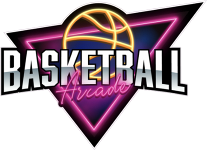

# Basketball Arcade

[Click here to play the game!](https://github.com/Rafa3399/basketball-arcade)

## Description
This is Basketball Arcade, a game that replicate the enjoyment you can get playing this arcade game in real life. The game ends when the countdown reach 0. When it's over, you get a score based on the points you got and you can save it to compare with other players.

## MVP
_MVP definition here, list of minimum features_

## Backlog
_List of features you might implement after the MVP_

## Data structure
_List of classes and methods_

## States y States Transitions
_List of states (views) of your game_

## Task
_List of tasks in order of priority_

## Links

- [Trello Link](https://trello.com)
- [Slides Link](http://slides.com)
- [Github repository Link](https://github.com/Rafa3399/basketball-arcade)
- [Deployment Link](https://github.com/Rafa3399/basketball-arcade)